# AIHTTPServer

1. 2025.11.30 
    完成了`HttpRequest`功能的实现。

2. 2025.12.01
    完成了`HttpContext`, `HttpResponse`功能的实现

3. 2025.12.02
    完成了`router`功能的实现

3. 2025.12.03
    完成了`session`功能的实现

4. 2025.12.04 
    完成了`middleware`以及`ssl`部分功能的实现

5. 2025.12.05
    完成了`ssl`功能的实现

6. 2025.12.07
    完成了`http`整体功能的编写

7. 2025.12.14
    完成了五子棋部分的编写，但功能仍存在问题

8. 2025.12.15
    发现或解决了以下问题

- 问题一：
    浏览器输入`127.0.0.1:8081`时访问失败，出现以下界面：
    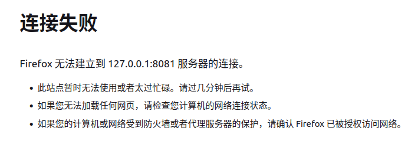
    
    `conn->getMutableContext()` 返回的 `boost::any` 对象中存储的不是 `HttpContext` 类型，转化失败，于是返回`nullptr`。
    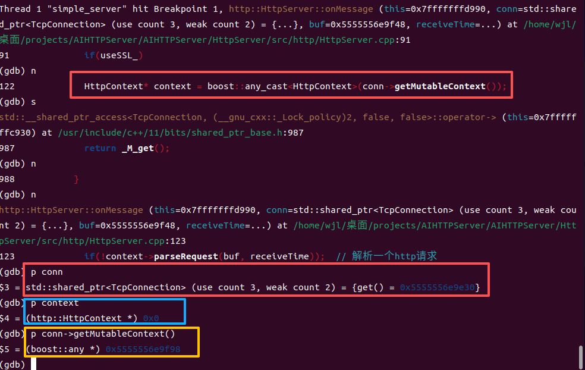
    
    进而发现，`TcpConnection`的`boost::any context_`并没有被赋值，成员函数`setContext()`并没有被调用。这个函数的调用发生在`HttpServer`提供的连接事件的回调函数`onConnection()`中：
    ```cpp
    if(conn->connected())  // 新用户连接
    {
        // ......
        conn->setContext(HttpContext());
    }
    ```
    那么很有可能是连接失败了，既`conn->connected()`返回了`false`。通过调试后发现确实如此：

    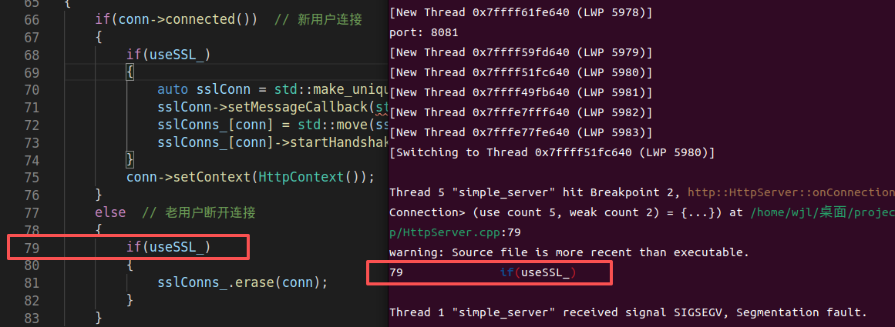

    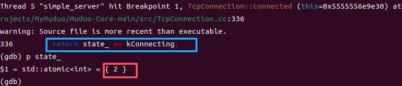
    
    如图所示，当前`state_`的状态是`2`, 对应`kConnected`, 这是期望的状态，在muduo网络库编写时条件判断写错了，应该是
    ```cpp
    return state_ == kConnected;  // state_ == kConnecting; 错误
    ```

<br>

- 问题二：
    浏览器输入`127.0.0.1:8081`时访问失败，出现以下界面：

    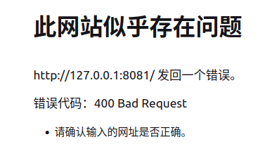

    gdb调试没有显示任何问题，但是从打印的日志中我们可以看到响应行的问题，这里应该是`HTTP/1.1 200 OK`而不是`HTTP/1.1 200OK`。

    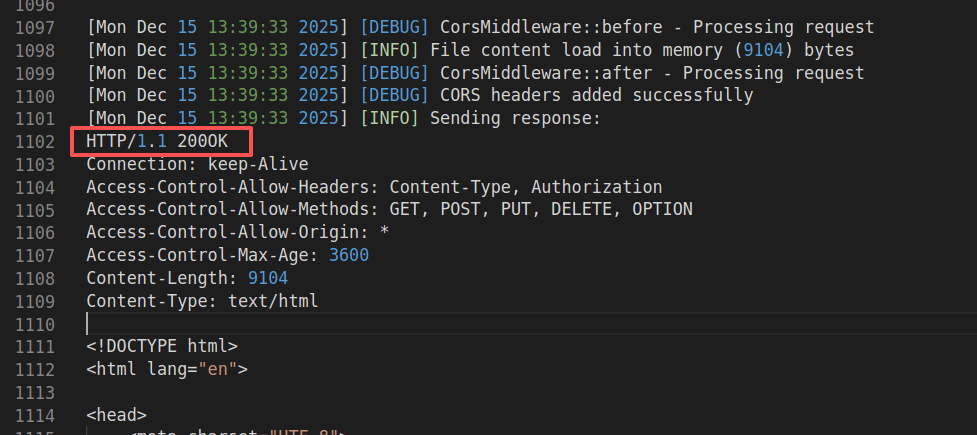

    上面的问题还没有解决，通过`tcpdump`抓包发现400， 用gdb调试也发现了相应的问题，说明解析报文的过程出错了，于是函数返回了`false`

    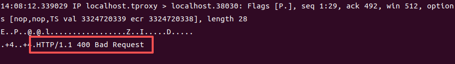

    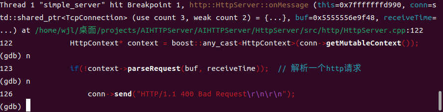

    ```cpp
    if(!context->parseRequest(buf, receiveTime))  // 解析一个http请求
    {
        // 如果解析HTTP报文中出错
        conn->send("HTTP/1.1 400 Bad Request\r\n\r\n");
        conn->shutdown();
    }
    ```
    调试发现`context->parseRequest(buf, receiveTime)`是正确返回`true`，问题在于判断语句后面加个分号。

    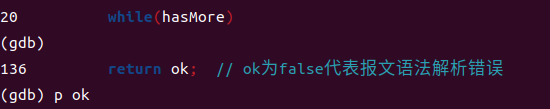

    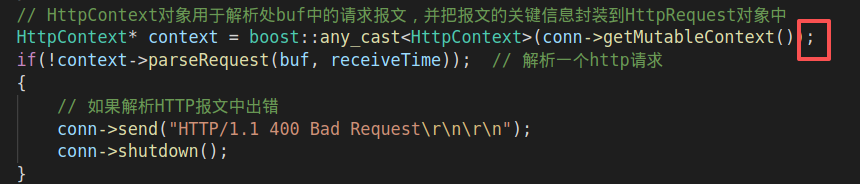

    修改后，就可以正常显示页面了。

    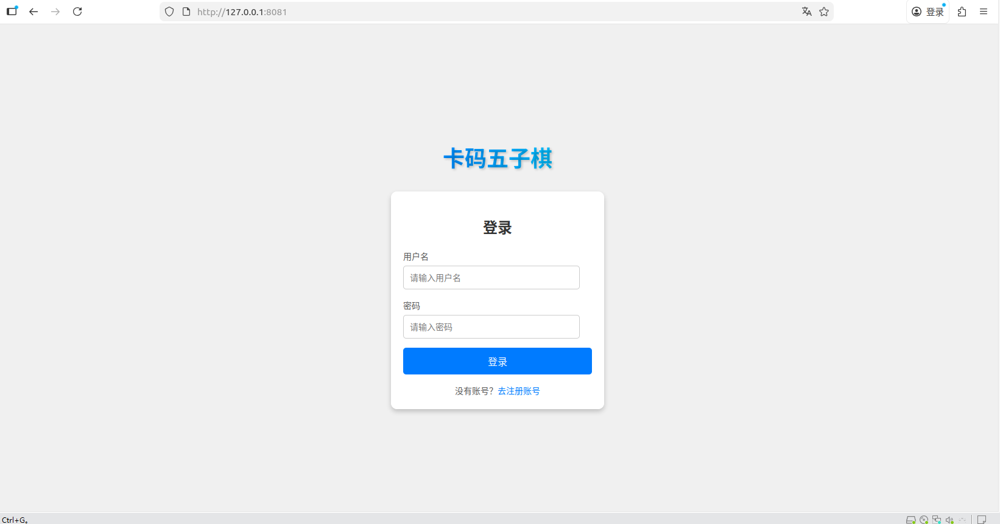

<br>

- 问题三

    正常注册登录后，显示如下的结果：

    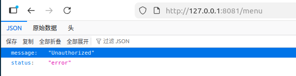