# AIHTTPServer

1. 2025.11.30 
    完成了`HttpRequest`功能的实现。

<br>

2. 2025.12.01
    完成了`HttpContext`, `HttpResponse`功能的实现

<br>

3. 2025.12.02
    完成了`router`功能的实现

<br>

3. 2025.12.03
    完成了`session`功能的实现

<br>

4. 2025.12.04 
    完成了`middleware`以及`ssl`部分功能的实现

<br>

5. 2025.12.05
    完成了`ssl`功能的实现

<br>

6. 2025.12.07
    完成了`http`整体功能的编写

<br>

7. 2025.12.14
    完成了五子棋部分的编写，但功能仍存在问题

<br>

8. 2025.12.15
    发现或解决了以下问题

<br>

- 问题一：
    浏览器输入`127.0.0.1:8081`时访问失败，出现以下界面：
    
    
    `conn->getMutableContext()` 返回的 `boost::any` 对象中存储的不是 `HttpContext` 类型，转化失败，于是返回`nullptr`。
    
    
    进而发现，`TcpConnection`的`boost::any context_`并没有被赋值，成员函数`setContext()`并没有被调用。这个函数的调用发生在`HttpServer`提供的连接事件的回调函数`onConnection()`中：
    ```cpp
    if(conn->connected())  // 新用户连接
    {
        // ......
        conn->setContext(HttpContext());
    }
    ```
    那么很有可能是连接失败了，既`conn->connected()`返回了`false`。通过调试后发现确实如此：

    

    
    
    如图所示，当前`state_`的状态是`2`, 对应`kConnected`, 这是期望的状态，在muduo网络库编写时条件判断写错了，应该是
    ```cpp
    return state_ == kConnected;  // state_ == kConnecting; 错误
    ```

    <br>


- 问题二：
    浏览器输入`127.0.0.1:8081`时访问失败，出现以下界面：

    

    gdb调试没有显示任何问题，但是从打印的日志中我们可以看到响应行的问题，这里应该是`HTTP/1.1 200 OK`而不是`HTTP/1.1 200OK`。

    

    上面的问题还没有解决，通过`tcpdump`抓包发现400， 用gdb调试也发现了相应的问题，说明解析报文的过程出错了，于是函数返回了`false`

    

    

    ```cpp
    if(!context->parseRequest(buf, receiveTime))  // 解析一个http请求
    {
        // 如果解析HTTP报文中出错
        conn->send("HTTP/1.1 400 Bad Request\r\n\r\n");
        conn->shutdown();
    }
    ```
    调试发现`context->parseRequest(buf, receiveTime)`是正确返回`true`，问题在于判断语句后面加个分号。

    

    

    修改后，就可以正常显示页面了。

    

    <br>

- 问题三

    正常注册登录后，显示如下的结果：

    

<br>

10. 2025.12.16

    书接上回

    通过gdb调试后发现，客户端显示这个内容是因为在`MenuHandler::handle()`中，服务端并未能找到相应的会话，而这个原因是在`SessionManager::getSession()`中没有将Cookie字段添加到HTTP响应报文中，导致服务端没有把对于的会话ID发送给客户端，客户端下一次发送HTTP请求报文时，其中没有包含相应的Cookie，服务端查不到对于的SessionId，就又创建一个新的会话。

    

    修复方法，在创建新的会话时调用`setSessionCookie(sessionId, resp);`，这样就能正常的进入菜单了。

    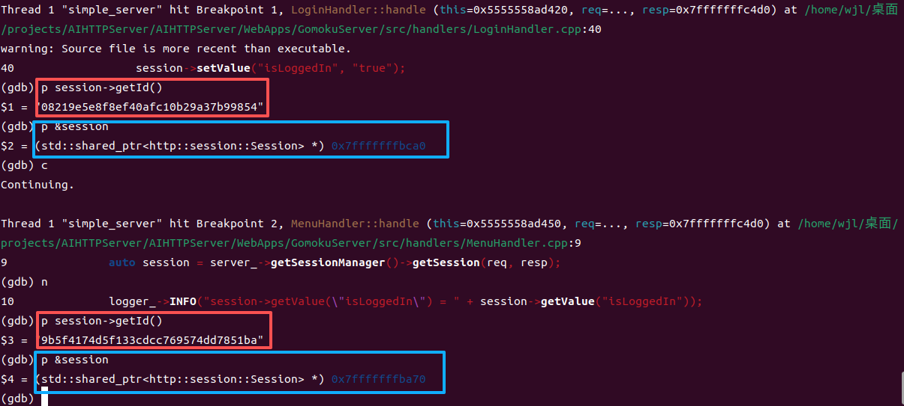
    

    <br>

- 问题四

    第一次登陆成功后进入菜单，之后再次登陆就登陆失败。原因在与会话下载的判断，如果加载成功，就会返回相应的会话，如果失败，就会返回nullptr，但在加载之后又调用了`session->isExpired()`来判断。如果加载失败，就会出错，因此修改逻辑即可，把`session->isExpired()`改为`!session`
    ```cpp
    if(it != sessions_.end())
    {
        if(!it->second->isExpired())
        {
            return it->second;
        }
        else
        {   // 如果会话过期，则从存储中移除
            sessions_.erase(it);
        }
    }
    return nullptr;
    ```

    
    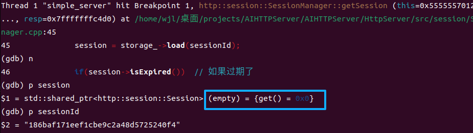

<br>

11. 2025.12.17

- 问题五，依然是问题三的显示情况。通过gdb调试后发现，客户端发送的两次请求报文(登录和登录成功后的界面)中，Cookie的SessionId居然是不一样的。

    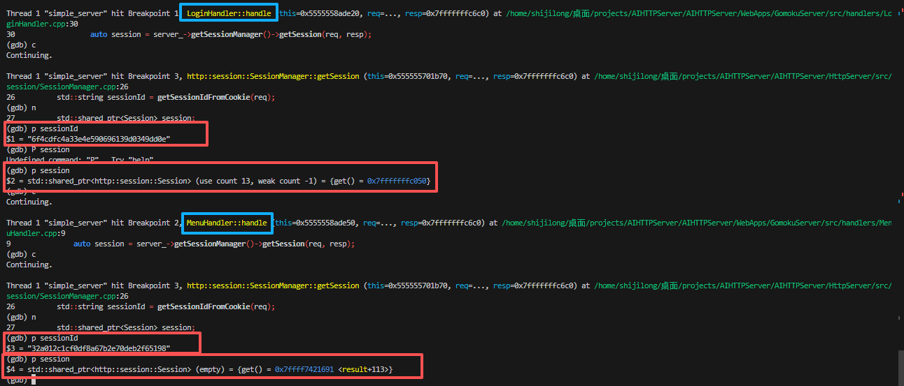

    进一步调试发现，在`LoginHandler()`中，`sessionId`不为空，但是用这个`sessionId`从`storage_`中查找对于会话时找不到，于是`load()`返回了`nullptr`，程序就会认为会话过期了，就重新创建一个新的会话。于是前两次会话的`sessionId`是不一样的。

    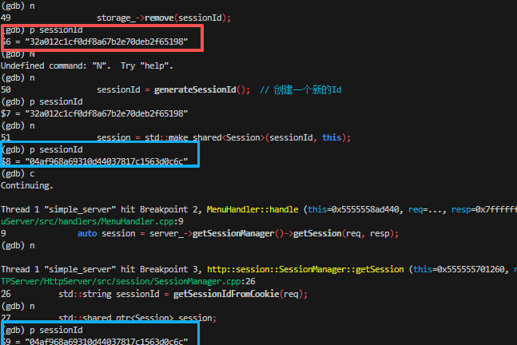

    在`MenuHandler()`中，`seesionId`同样不为空，并且在`storage_`存放着对对应的键值对，但是在加载过程中显示该会话已经过期了，因此还是返回`nullptr`，按道理来说应该不可能过期的，代码上出现了笔误，在Session的构造函数上。

    ```cpp
    Session::Session(const std::string& sessionId, 
            SessionManager* sessionManger, int maxAge):
    sessionId_(sessionId),
    sessionManager_(sessionManger),
    maxAge_(maxAge)  // maxAge_(maxAge_) 这里出了问题
    ```

    修改后就可以正常进入菜单了。

    <br>

- 问题五

    ai无限思考中......

    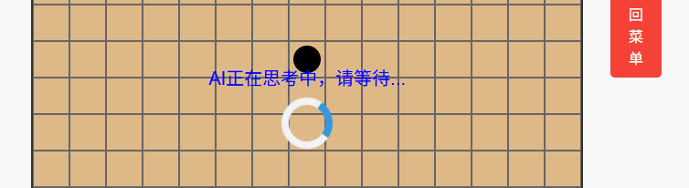

    调试发现，落子对于的路由是`/aiBot/move`，但是却找不到对于的路由函数。

    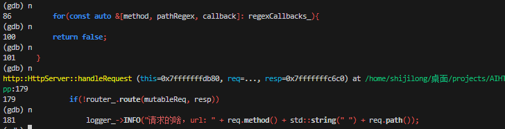

    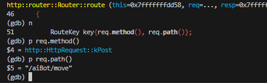

    ```cpp
    // 下棋
    httpServer_.Get("/aiBot/move", std::make_shared<AiGameMoveHandler>(this));
    ```
    这里注册路由的时候请求方法是`Get`，但实际请求报文中的请求方法是`POST`，二者不匹配，故找不到对于的路由函数。

    修改，将`.Get()`改成`.Post()`，就可以正常落子了

    <br>

- 问题六

    AI只会沿着第一行落子，并且判定胜利条件有误

    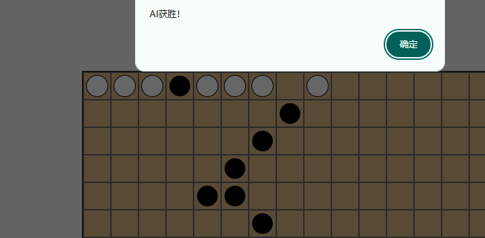

    均已修复，所有功能都正常了。

<br>

# 用该HTTP框架实现一个简单聊天服务器


## 路由设计

在原先基于muduo的集群聊天服务器中，用户会给`server_`提供`onMessage(const TcpConnectionPtr&, Buffer*, Timestamp)`，在该函数中，接收到的消息会放在`buffer`中，通过`buffer`的函数可以将其中的数据转为字符串，再通过`json::parse()`进行反序列化。
```cpp
string buf = buffer->retrieveAllAsString();
json js = json::parse(buf);
```
其中`js["msgid"]`表示该消息的类型(登录，注册，单人聊天等等)。然后根据消息的类型调用相应的回调函数。
```cpp
unordered_map<int, MsgHandler> _msgHandlerMap;
...
_msgHandlerMap.insert({LOGIN_MSG, std::bind(&ChatService::login, this, _1, _2, _3)});
_msgHandlerMap.insert({REG_MSG, std::bind(&ChatService::reg, this, _1, _2, _3)});
_msgHandlerMap.insert({ONE_CHAT_MSG, std::bind(&ChatService::oneChat, this, _1, _2, _3)});
...
```

http框架中，`HttpServer`已经为`server_`提供了相应的`onMessage()`(和`onConnection()`)方法。因此在使用方法上有所不同。通过注册路由的方法。
```cpp
class LoginHandler: public http::router::RouterHandler
{
public:
    explicit LoginHandler(ChatServer* server): server_(server){}
    void handle(const http::HttpRequest& req, http::HttpResponse* resp) override;
private:
    ChatServer* server_;
    http::MysqlUtil mysqlUtil_;
};

...

httpServer_.Post("/login", std::make_shared<LoginHandler>(this));
```
这里的路由扮演着`msgid`相同的角色，在`handle()`函数中，通过解析请求体重的内容来获取客户端发送的内容。
```cpp
json parsed = json::parse(req.getBody());
```
因此我们可以按照消息类型注册若干个路由
```cpp
// 登录注册入口页面
httpServer_.Get("/", std::make_shared<EntryHandler>(this));
httpServer_.Get("/entry", std::make_shared<EntryHandler>(this));

httpServer_.Post("/login", std::make_shared<LoginHandler>(this));  // 登录(客户端点击登录时)
httpServer_.Post("/register", std::make_shared<RegisterHandler>(this));  // 注册

// 登录后进入用户界面
httpServer_.Post("/user/friend", std::make_shared<FriendChatHandler>(this));  // 单人聊天 
httpServer_.Post("/user/friend/send", std::make_shared<FriendChatSendHandler>(this)); // 向好友发送消息
httpServer_.Post("/user/friend/exit", std::make_shared<FriendChatExitHandler>(this)); // 退出好友聊天

httpServer_.Post("/user/group", std::make_shared<GroupChatHandler>(this));  // 群聊聊天 
httpServer_.Post("/user/group/send", std::make_shared<GroupChatSendHandler>(this)); // 向群聊发送消息
httpServer_.Post("/user/group/exit", std::make_shared<GroupChatExitHandler>(this)); // 退出群聊聊天

httpServer_.Post("/user/logout", std::make_shared<LogoutHandler>(this));  // 退出登录 
```

## 数据库设计

数据库的设计符合第三范式。

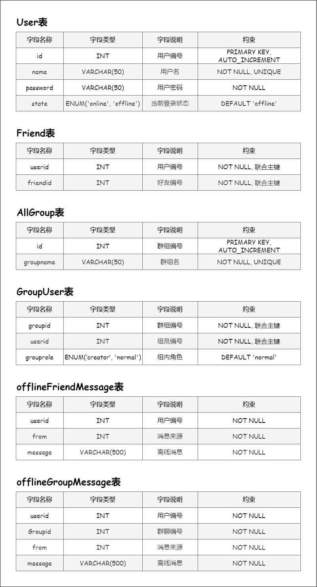

这里登录状态的在线和离线表示用户是否在与自己的聊天窗口中，如果是，则直接显示，否则都存入离线消息数据库中。


<br>

12. 2025.12.20

    完成了用户的注册和登录

    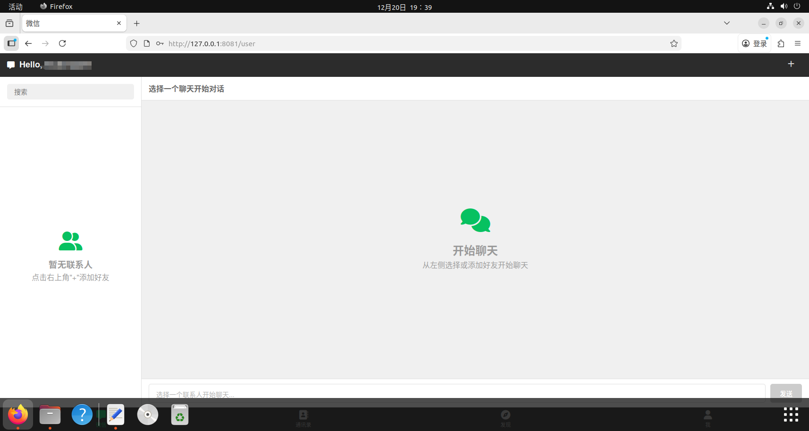

<br>

13. 2025.12.21

    完成了添加用户的功能

    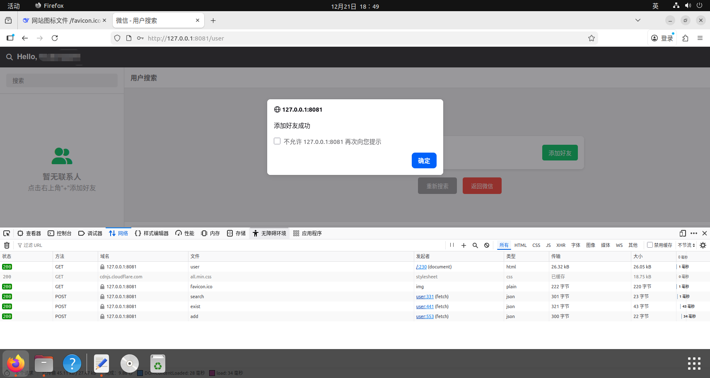

    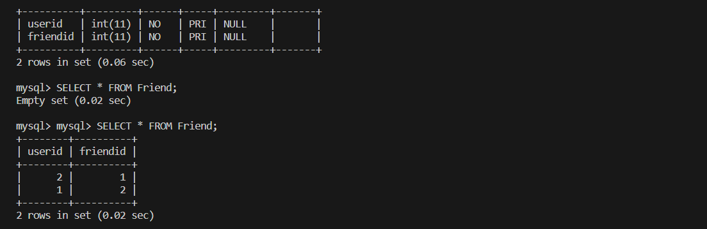
    
<br>

14. 2025.12.22

    实现了在登陆后加载页面的同时加载好友列表。

    通过将发送的消息存入离线消息数据库`offlineMessage`中，当接收方登陆时就会同时从数据库中加载离线消息并显示，并从数据库中把消息删除掉。

    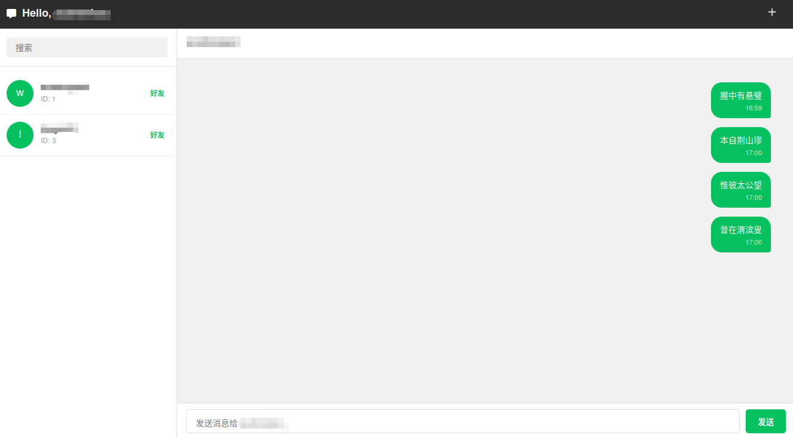
    
    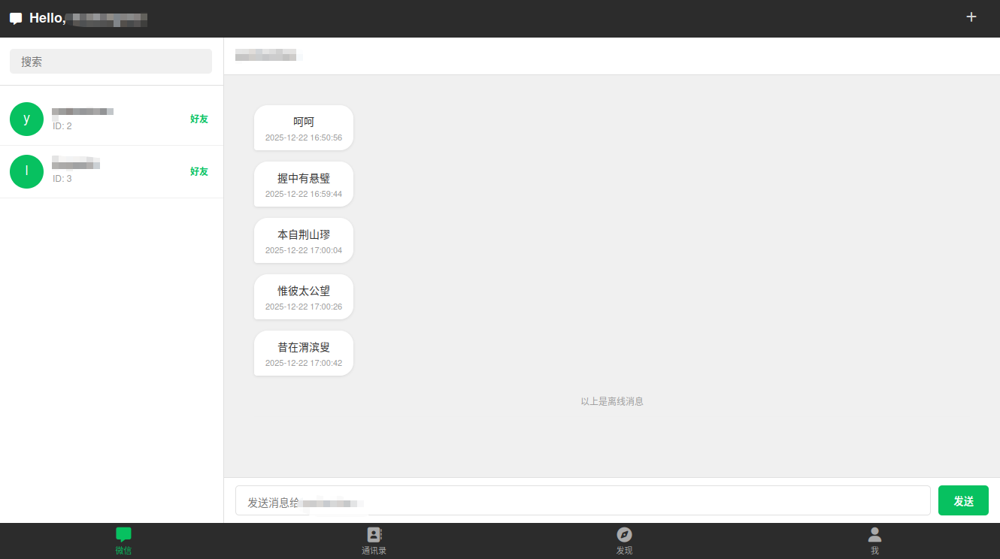

<br>

15. 2025.12.23

    实现实时聊天消息显示(当用户收到新消息时，如果正好处在于对方的聊天页面，就直接显示，如果不是，则在左侧对应位置打个小红点)，如何让另一个客户端知道有消息到来？

    实现聊天记录的存储，并在加载页面的时候加载聊天记录，但是处于安全考虑，浏览器是无法直接访问某个文件内容的，必须手动选择要加载文件。即使登陆的时候可以手动处理，依然是需要手动操作来保存聊天记录。

    将聊天记录简单存储在服务器的数据库上，每次登陆加载的时候从中加载对应的数据。

    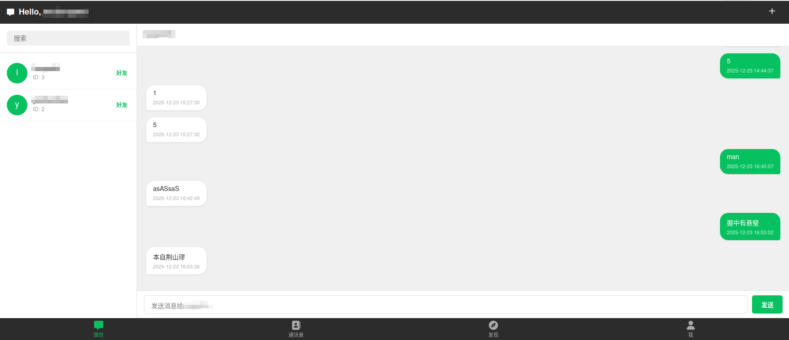

<br>

# 投放若干个AI聊天机器人

- 对接阿里的大语言模型
- 用户可以像添加好友一样添加机器人为好友
- 用户(客户端)--->服务器(接收到消息，把消息给到大模型，大模型生成对应文本)--->用户(客户端)

<br>

16. 2025.12.24

    实现了`MessageQueue`部分代码

    修复了陌生人查找时异常弹窗

<br>

- 创建一张表，存放机器人的`Id`, `name` 以及 `API-Key`。

- 再创建一张表，存在用户和机器人的“好友”关系。这个关系是单向的，添加的时候只有(用户id, 机器人id)，没有(机器人id，用户id)。

    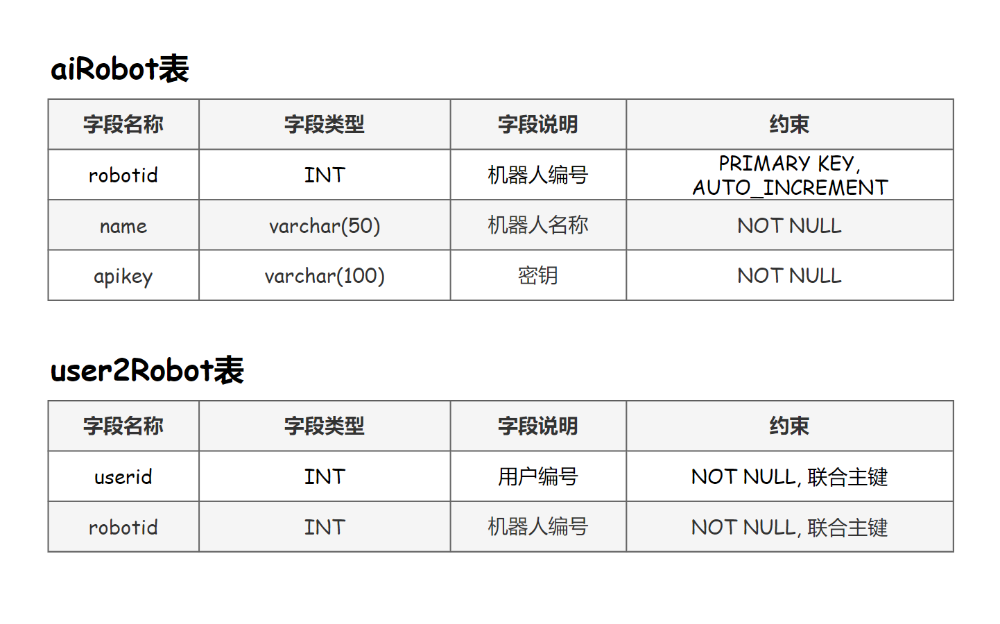


<br>

17. 2025.12.25

    实现了携带不同`api-key`的AI聊天机器人的投放，以及用户自行添加AI机器人到列表中

    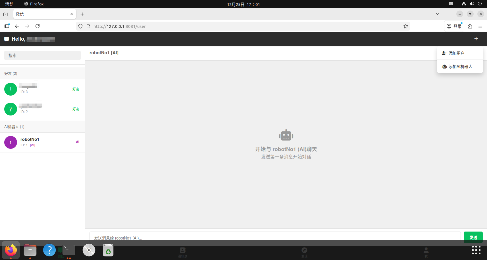

    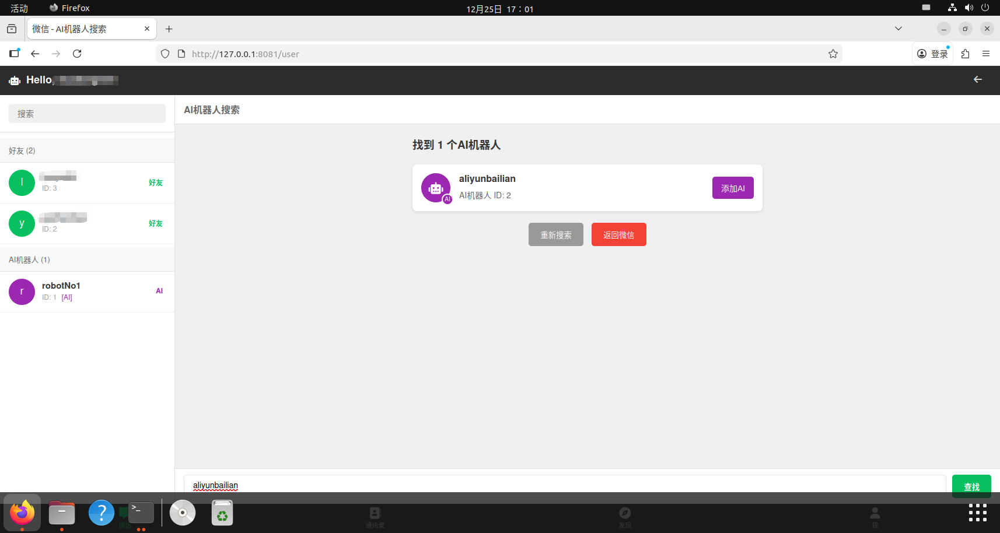

<br>

- 再创建一张表，记录用户和对应`AI`的聊天记录

    因为用户`ID`和机器人的`ID`是独立的，因此不能像`offlineFriendMessage`一样仅仅用发送方和接收方来区分。

    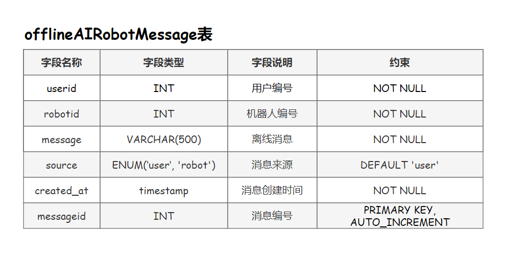

<br>

18. 2025.12.26

    实现了简单的AI聊天(阿里云百炼)

    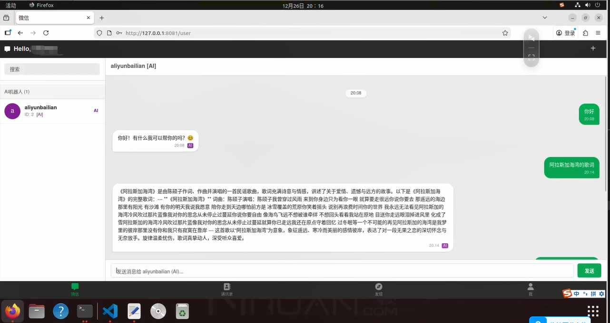

<br>

19. 2025.12.27

    实现了AI聊天消息到数据库的记录

    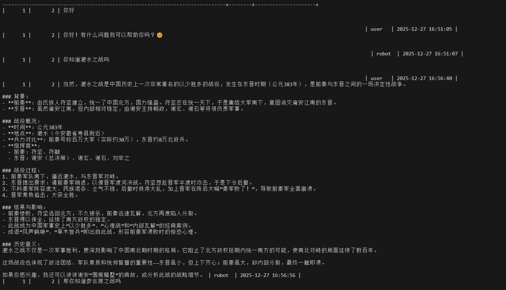

- 问题七

    AI与用户的聊天记录写入数据库时失败了，通过直接使用mysql语句插入数据是没有问题的。因此问题出在代码这边，通过gdb调试定位到：
    
    ```cpp
    std::unique_ptr<sql::PreparedStatement> stmt(conn_->prepareStatement(sql));
    bindParams(stmt.get(), 1, std::forward<Args>(args)...);
    return stmt->executeQuery();
    ```

    最终发现是ai回答问题偶尔会带几个表情包，这些特殊字符编码出现问题。

    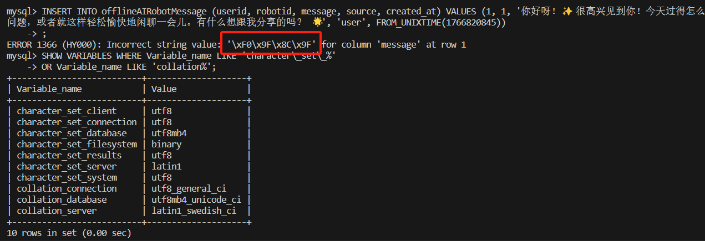

<br>

20. 2025.12.28

    修改了获取离线消息的逻辑：从登录时直接加载所有好友的聊天消息，改为点击左侧相应的好友聊天框时加载对应好友的聊天消息。

    ```python
    # cos 慕容垂的 ai, 打着胜利主义的旗帜，实则内心的失败主义无比坚定，早就在准备光复大燕了
    ```
    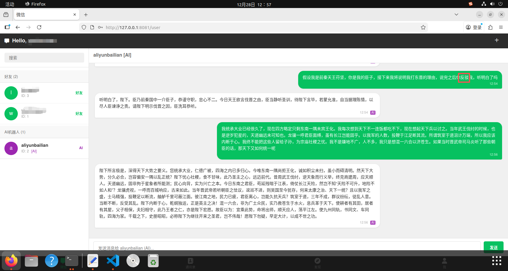


<br>

21. 2025.12.29

    尝试集成多种类型的ai大模型。

    完成`AIConfig`, `AIFactory`, `AIStrategy`, `AIToolRegistry`的编写

    因为与原项目业务上的差别越来越大，实际上`Message Queue`是没有使用到的


    原先的逻辑，每次发送的都是独立的提问和回答，AI无法联系上下文进行回答。正确的做法应该是把问题加上之前全部的问答发给AI，如图所示，看似是仅仅发送了红框的内容，实际上是发送了蓝框的内容，从而使得AI能够结合之前的问答给出答案。

    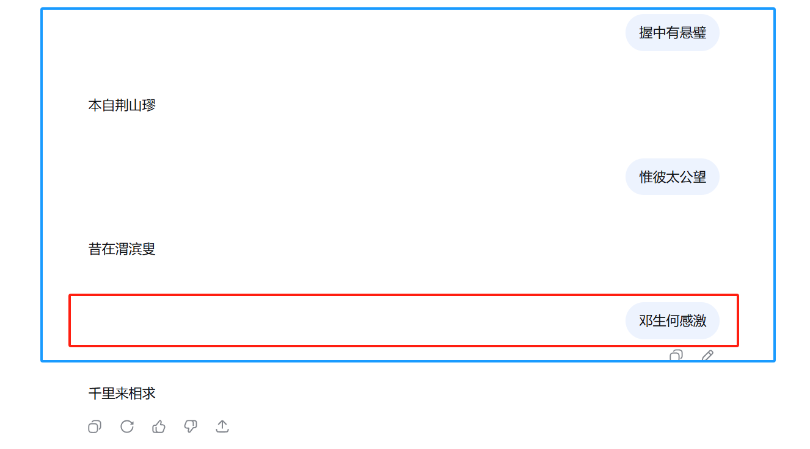

    因此，登录后加载历史聊天记录的时候，应该把之前的聊天记录都写到一个容器当中，新发送的消息也要添加到其中，发送消息时把容器中的问答对加到问题的前面，一同发送给AI。

<br>

22. 2025.12.30

    修改了聊天发送逻辑，把历史问答添加到本次问题的前面，使得AI可以根据上文进行回答，而不是每次都是独立的思考。

    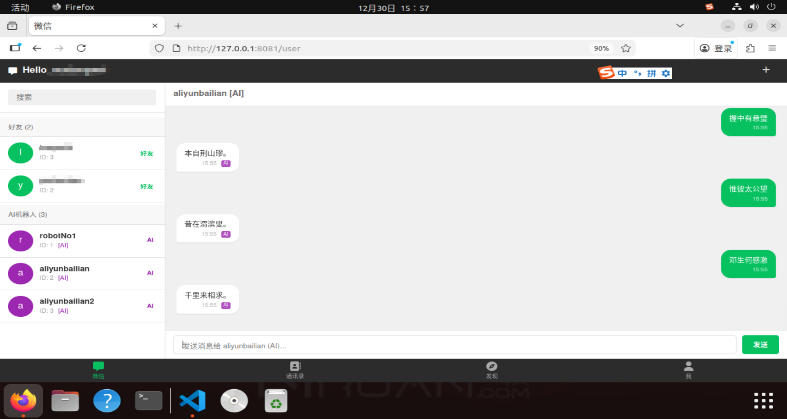

- 问题八

    对于新添加的AI，一向他发送消息就会出现段错误，通过`gdb`调试显示以下内容：

    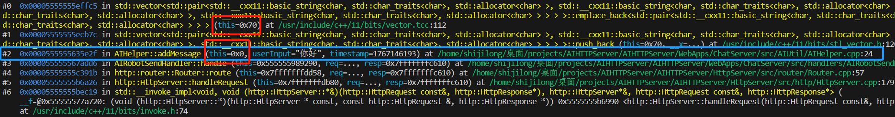

    说明`AIRobotSendHandler.cpp`中，通过这样获取到的`AIHelperPtr`是一个`nullptr`。因为`chatInformation`的构建是在用户点开左侧AI列表中指定的某个AI时调用执行的(触发`OfflineAIMessageShowHandler`)，它会从数据库中获取当前用户和当前AI的聊天记录，遍历取出来的数据时，如果发现当前用户和当前AI的会话(`AIHelper`)不存在，那么就会创建。但前提是，遍历取出来的数据，如果数据库中本来就没有二者的聊天记录，`while(res->next())`就不会执行，因此相应的会话也不会被创建。
    ```cpp
    auto& AIHelperPtr = server_->chatInformation[userId][targetAIRobotId];
    ```
    ```cpp
    while(res->next())  // 如果没有任何聊天记录，那么这个循环根本不会开始，因此不会创建AIHelper
    {
        ...

        auto& userSessionsMap = server_->chatInformation[userId]; // user会话map，和若干个AI的会话
        std::shared_ptr<AIHelper> helper;
        auto itSession = userSessionsMap.find(robotId);  // user和某个robot的会话
        if(itSession == userSessionsMap.end())
        {   // 如果没有这个会话
            helper = std::make_shared<AIHelper>(apikey);
            userSessionsMap[robotId] = helper;
        }
    }
    ```

<br>

23. 2025.12.31

    修复了新添加的AI提问时会直接出现段错误的问题。通过在发送数据时，检测当前用户和当前AI的会话(`AIHelper`)是否存在，如果不存在，就地创建一个新的。

-   问题九 

    使用`MQManager`提交数据，但是出现了`a socket error occurred`的错误，导致消息无法被写入到数据库当中。
    ```cpp
    std::string sql = "INSERT INTO offlineAIRobotMessage (userid, robotid, message, source, created_at) VALUES ("
        + std::to_string(userId) + ", "
        + std::to_string(robotId) + ", "
        + "'" + message + "'" + ", "
        + "'" + source + "'" + ", "
        + std::to_string(timestamp) + ")";
    MQManager::instance().publish("sql_queue", sql);
    ```
    
    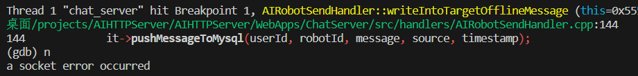
    
    发现是`RabbitMQ`配置和部署，以及`sql`语句的问题，解决后，聊天消息就可以正确的写入数据库当中了。

    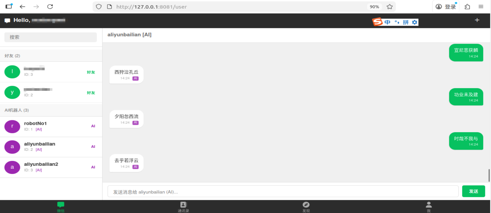

    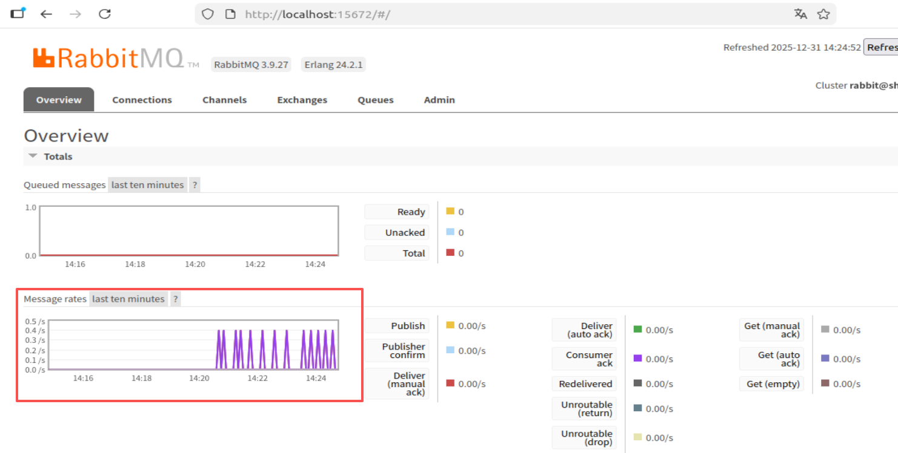

    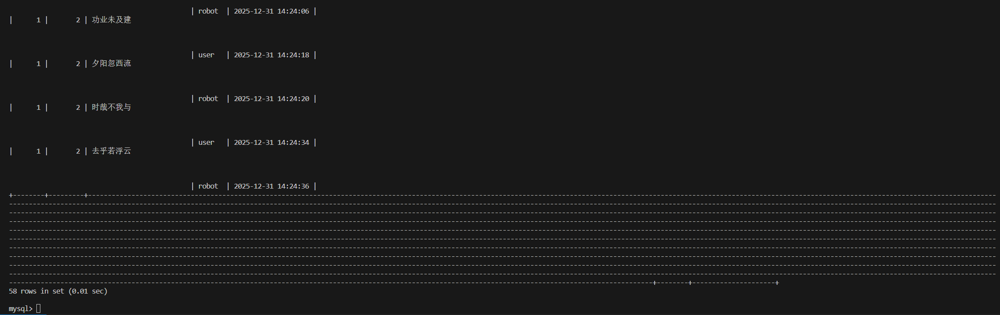

    但重新登陆后，部分聊天记录的显示顺序有问题。

    从web端聊天记录的显示上来看，消息的时间戳是没有问题的，但是出现了新消息显示在旧消息之上的情况。检查数据库，发现了一样的问题。
    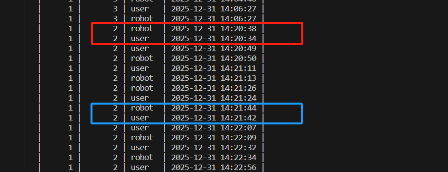

<br>

24. 2026.1.1

    修复了消息显示顺序的问题，查表的时候直接按时间戳的升序排序。

    修复了登录成功进入聊天页面后自动发送一次获取离线消息(获取失败但是不影响接下来的使用)


<br>

25. 2026.1.4

    实现集成多个不同类型AI的模型，包括：`Aliyun`, `DouBao`, `AliyunRAG`, `AliyunMcp`

    一个`AIHelper`对应一个AI聊天机器人。在获取对应AI的聊天记录的时候创建或获取(web端点击左边AI列表中对应的AI时)。`AIHelper`中存储了`AIStrategy`类型的指针，原先的`apiKey`, `model`和`apiUrl`都被存储到了其中。

    使用工厂方法`StrategyFactory`分离出`AIStrategy`的创建，并且`StrategyFactory`本身是单例模式。在`AIHelper`的方法中获取这个单例去创建对应的`AIStrategy`。

    首先，需要修改数据库`AIRobot`的结构，在原有的基础上添加一条字段表示策略的类型，用整形来记录，使用的时候转为字符串类型即可。目前有4种`AIStrategy`，其对应的策略类型分别如下所示：
    
    ```cpp
    static StrategyRegister<AliyunStrategy> regAliyun("1");
    static StrategyRegister<DouBaoStrategy> reDoubao("2");
    static StrategyRegister<AliyunRAGStrategy> regAliyunRag("3");
    static StrategyRegister<AliyunMcpStrategy> regAliyunMcp("4");
    ```

    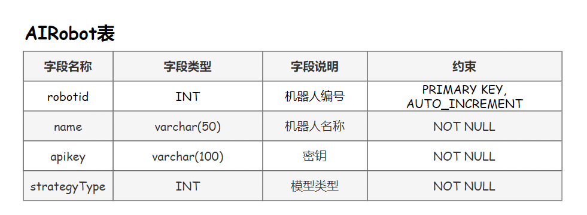

<br>

26. 2026.1.5

    移除了从环境变量中获取api key的方法
    
    修复了改动较大导致的聊天记录无法正常加载的问题

    之前的版本，服务器启动的时候会调用上面的四个语句，取其中一个举例说明：

    ```cpp
    static StrategyRegister<AliyunStrategy> regAliyun("1");
    ```
    调用`StrategyRegister`的构造函数，往`StrategyFactory`的单例中注册策略，即把策略编号(例子中的"1")即该策略对应的构造函数方法在`StrategyFactory`中的记录注册后的策略的`creators`（一个unordered_map）记录。

    ```cpp
    std::unordered_map<std::string, Creator> creators;
    ```
    当需要创建对应的`AIStrategy`时，就通过`StrategyFactory.create("1")`进行创建，在这个函数中，会从`StrategyFactory`的`creators`中找对于策略编号的策略的构造函数进行调用，返回创建好的策略。

    我们希望在`AIHelper`创建时创建对应的`AIStrategy`，因此，提供了`AIHelper`的有参构造函数的重载版本，并给策略提供设置`apiKey`的方法，这样需要的时候可以直接访问，而不用从数据库中获取。
    ```cpp
    AIHelper::AIHelper(const int& strategyType, const std::string& apiKey)
    {   // 创建对应的策略
        strategy = StrategyFactory::instance().create(std::to_string(strategyType)); 
        
    }
    ```

<br>

27. 2026.1.6

    添加`doubao-seed-1-6-thinking-250715`模型。

    修复了改动较大导致的AI无法正常回复的问题(网络连接失败，请检查连接后重试)

    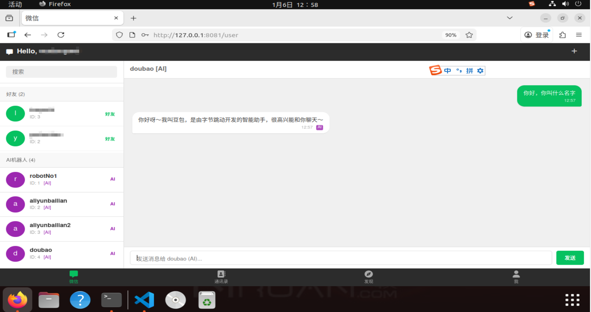
    
<br>

28. 2026.1.7

    使用《晋书》苻坚载记构建阿里知识库，搭建`RAG`模型

    `RAG`的全称为`Retrieval-Augmented Generation`，中文翻译时"检索增强生成"。简单来说，`RAG`就是让`AI`在回答问题前，先去资料库里找相关内容(检索)，再结合这些资料生成回答。这里截取了《晋书》中苻坚载记上下，帮助AI解答前秦天王苻坚的生平，经历等相关内容。

    阿里云百炼的RAG模型输入的json结构和输出的json结构于阿里云百炼和豆包不同，因此，将原本的`AIHelper`::chat()的主要逻辑在其成员`AIStrategy`中实现，再在`AIHelper`::chat()中统一调用。在`AIStrategy`中实现chat()的逻辑需要把`AIHelper`中的message传给它。

    下面是普通的阿里云百炼模型和带`RAG`的阿里云百炼模型:

    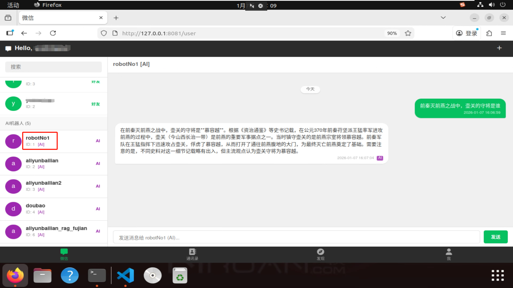

    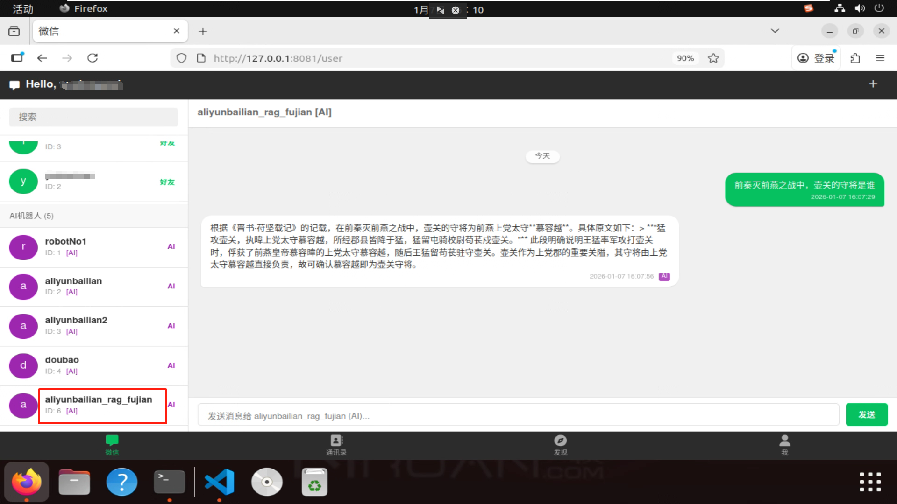

<br>

29. 2026.1.8

    修正了智能体`ID`硬编码的问题。

    由于`RAG`模型的使用依赖于一个智能体应用的`Id`，之前使用的是硬编码的方法。如果在`AIRobot`添加一个新的属性记录`applicationId`，这违反了关联型数据库的第三范式：`applicationId`不仅依赖于主属性`robotid`(每个机器人对应不同的智能体应用Id)，还依赖于`stragtegyType`(只有为类别3时才有意义)。

    ```sql
    CREATE TABLE AIRobot_Application (
        robotid INT PRIMARY KEY,
        applicationId VARCHAR(100) NOT NULL,
        FOREIGN KEY (robotid) REFERENCES AIRobot(robotid) ON DELETE CASCADE
    );
    ```

    在`AliyunRAGStrategy`中，额外增加一个成员变量用来存储`applicationId`。

    在`OfflineAIMessageShowHandler`中创建`AIHelper`的过程中，如果`strategyType`是3，就同时从数据库中读取当前`robotId`对应的`applicationId`。

    ```cpp
    // 为RAG模型设置对应的智能体应用Id
    bool AIHelper::setApplicationIdForRAG(std::string aid) const
    {
        AliyunRAGStrategy* ptr = dynamic_cast<AliyunRAGStrategy*>(strategy.get());
        if(ptr != nullptr){
            ptr->setApplicationId(aid);
            return true;
        }
        return false;
    }
    ```
