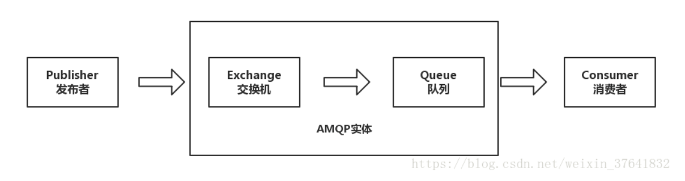

# MQ: Message Queue

## AMQP: Advanced Message Queuing Protocol
AMQP(高级消息队列协议), 是一个进程间传递异步消息的网络协议.



- 发布者（Publisher）发布消息（Message），经由交换机（Exchange）
    ```cpp
    auto message = AmqpClient::BasicMessage::Create(msg);  // 创建消息对象
    conn->channel->BasicPublish("", queue, message);  // "": 默认的交换机, queue: 路由键, message: 消息
    ```
- 交换机根据**路由规则**将收到的消息分发给**与该交换机绑定的队列**（Queue）
    
- 最后 AMQP 代理会**将消息投递给订阅了此队列的消费者**，或者**消费者按照需求自行获取**
    ```cpp
    auto channel = AmqpClient::Channel::Create(rabbitmq_host_, 5672, "guest", "guest", "/");
    channel->DeclareQueue(queue_name_, false, true, false, false);  // 声明一个名为queue_name_的队列

    std::string consumer_tag = channel->BasicConsume(queue_name_, "", true, false, false);  // 订阅queue_name_的消费者

    bool ok = channel->BasicConsumeMessage(consumer_tag, env, 500); // 把消息放到env中
    std::string msg = env->Message()->Body();  
    ```

## RabbitMQ

基于`AMQP`协议的`MQ`产品

`RabbitMQ`的可靠性非常好，数据能够保证百分之百不丢失，但它的吞吐量较低(万级)，相较于`kafka`这种可以支持十几万并发的比还有很大差距。


